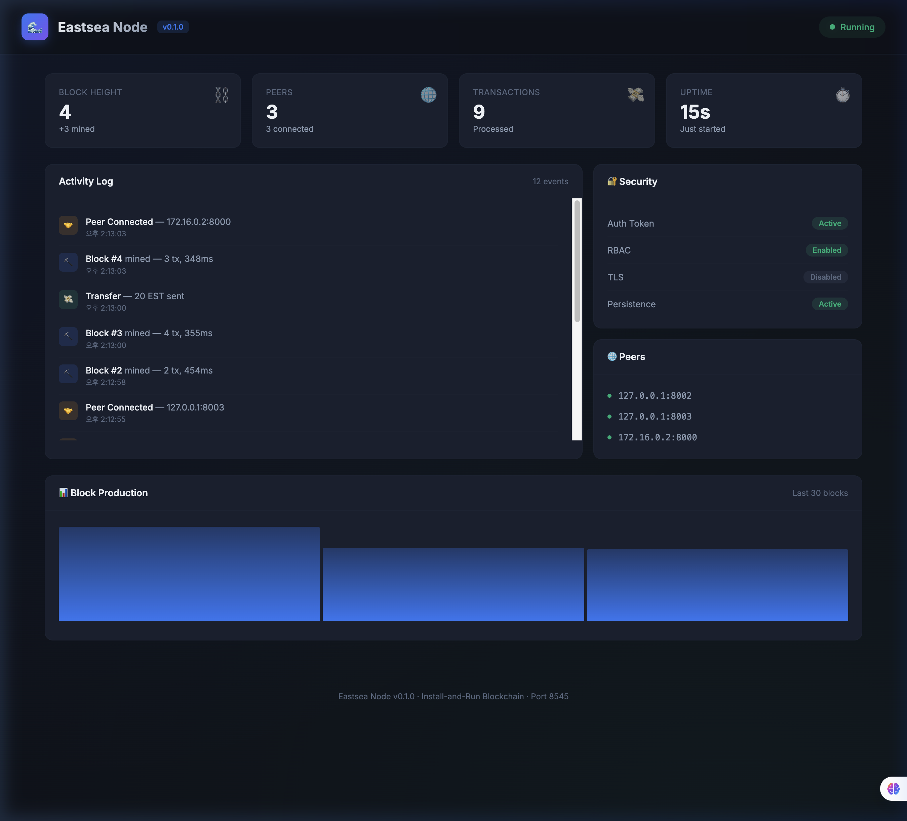

# Eastsea Node

블록체인 노드 구현 — "Install-and-Run" 철학 기반



## 빠른 시작

```bash
# macOS 원클릭 설치
bash scripts/install-macos.sh install

# 또는 소스 빌드
zig build && ./zig-out/bin/eastsea-production

# DMG 패키지 생성
bash scripts/create-dmg.sh 0.1.0

# Docker
docker compose up
```

실행 후 **http://127.0.0.1:8545** 에서 대시보드가 자동으로 열립니다.
macOS 패키지 앱(DMG)은 상태바 메뉴 앱(`eastsea-launcher`)를 통해 실행되며, 메뉴에서 `Dashboard 열기 / 노드 시작-중지 / 업데이트 확인 / 종료`를 제어할 수 있습니다.
기본 실행 시 앱이 자동으로 최신 업데이트를 확인하고, 새 버전이 있으면 즉시 다운로드/교체 후 재시작합니다.

## 자동 업데이트

```bash
# 기본 실행: 자동 업데이트 확인 + 적용
./zig-out/bin/eastsea-production

# 최신 버전 확인만 수행
./zig-out/bin/eastsea-production --check-update

# 최신 버전 확인 후 즉시 적용(기본 동작과 동일)
./zig-out/bin/eastsea-production --auto-update

# 자동 적용 없이 버전만 확인
./zig-out/bin/eastsea-production --no-auto-update

# 기본 manifest URL을 대체 (CI/테스트/스테이지용)
./zig-out/bin/eastsea-production --manifest-url=file:///absolute/path/to/manifest.json --check-update
```

- 기본 매니페스트는 `src/update_manager.zig`의 `DEFAULT_MANIFEST_URL`을 사용합니다.
- 운영에서는 환경변수 `EASTSEA_MANIFEST_URL`로 기본 URL을 오버라이드할 수 있습니다.
- 기본 실행(`--auto-update` 또는 옵션 미지정) 시 다운로드/체크섬 검증 후 바이너리를 교체하고 `--skip-update`로 재시작됩니다.

## 릴리스 파이프라인

- macOS 릴리스는 `.github/workflows/release-macos.yml`에서 생성/업로드됩니다.
- 릴리스 자산:
  - `eastsea-production-macos-universal`
  - `EastseaNode-<version>-universal-macos.dmg`
  - `manifest.json`
- 릴리스 워크플로는 DMG 생성 후 `UT-120-05`(롤백 드라이런) 유닛 테스트를 선행합니다.

## 프로젝트 구조

```
src/
├── main.zig            # 엔트리포인트
├── onboarding.zig      # REQ-101: 온보딩 설정
├── boot_check.zig      # REQ-111: 포트/권한 진단
├── storage_init.zig    # REQ-110: 저장소 초기화
├── auth.zig            # REQ-001: 인증 토큰
├── tls_config.zig      # REQ-040: TLS/비밀 관리
├── rpc_validator.zig   # REQ-021: RPC mock 제거
├── updater.zig         # REQ-102: 버전 관리
├── update_manager.zig  # REQ-120: 업데이트 메커니즘
├── persistence.zig     # REQ-010: 영속성 보존
├── rbac.zig            # REQ-002: 역할 기반 권한
├── diagnostics.zig     # REQ-112: 진단 리포트
├── monitoring.zig      # REQ-121: 런타임 모니터링
├── cluster.zig         # REQ-122: 클러스터 관리
├── network/            # P2P/QUIC 네트워크
├── blockchain/         # 블록체인 코어
├── consensus/          # 합의 엔진
├── rpc/                # JSON-RPC 서버
└── cli/                # 지갑 CLI
scripts/
├── install.sh          # REQ-103: 설치 스크립트
└── ci.sh               # REQ-050/051: CI 파이프라인
docs/
├── PRODUCT_SPEC.md     # 제품 스펙
├── TEST_RESULTS.md     # 테스트 결과
└── REQ_TO_TEST_UC_MAP.md # 추적표
```

## CI 파이프라인

```bash
bash scripts/ci.sh 0.1.0       # 전체 파이프라인
bash scripts/ci.sh 0.1.0 test  # 테스트만
```

## 라이선스

MIT
