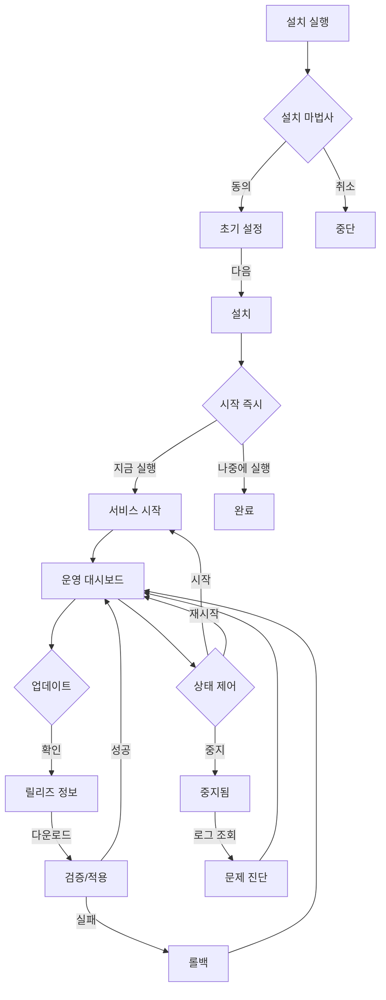

# Total User Experience Map (Eastsea Install-and-Run)

작성일: 2026-02-25  
버전: v1.1.0  
목표: Transmission의 "설치 후 실행" UX를 기준으로, 버튼 동작 레벨까지 동질적으로 규격화

## 1) 사용자 여정 단계

### Phase 0: 진입
사용자 입장: `다운로드/설치 파일 획득`

- 기대 동작
  - 플랫폼 자동 감지된 설치 안내
  - `지금 실행`이 기본인 설치 흐름
- 핵심 버튼
  - `설치 패키지 다운로드` / `실행`
- 감정 지표
  - 장애 포인트: 용량, OS 호환성 정보 부족
- 성공 지표
  - 설치 시작율 98% 이상

### Phase 1: 설치
사용자 입장: 마법사/CLI 첫 화면

- 핵심 화면
  1. 이용 약관
  2. 경로/포트 확인
  3. 보안 토큰 생성
  4. 설치 완료
- 버튼맵
  - `동의`, `다음`, `기본값 사용`, `경로 변경`, `포트 자동 변경`, `라이선스`, `취소`
- 성공 반응
  - 30초 내 `준비 완료` 표시
- 실패 반응
  - `ERR-...` 코드 + 즉시 대체 액션(`경로 재선택`, `권한 설정`, `포트 변경`)

### Phase 2: 즉시 실행
사용자 입장: 설치 완료 직후 자동 진입

- 버튼맵
  - `지금 실행`, `시작`, `상태 새로고침`, `진단 보기`
- 성공 반응
  - `/status` 호출 성공
  - 블록/피어 지표 표시
- 실패 반응
  - 포트 충돌이면 즉시 `권한/포트 해결` 버튼 노출

### Phase 3: 일상 운영
사용자 입장: 노드 관리

- 버튼맵
  - `중지`, `재시작`, `업데이트 확인`, `로그 보기`, `백업`, `피어 추가`, `피어 제거`
- 성공 반응
  - 2초 이내 UI 피드백 + 상태 반영
- 실패 반응
  - 중지 실패 시 강제 종료 옵션 제공

### Phase 4: 장애 대응
사용자 입장: 에러 또는 알람 상황

- 버튼맵
  - `문제 진단`, `로그 보기`, `롤백`, `지원 문의`, `자동 복구`
- 성능 목표
  - 진단 시작 후 1분 내 핵심 원인 항목 최소 1개 제시
- 감정 완충
  - 에러 문구의 기술 용어 최소화

### Phase 5: 종료/재설치
사용자 입장: 서비스 정리

- 버튼맵
  - `업데이트`, `제거`, `데이터 유지`, `데이터 삭제`
- 성공 반응
  - 사용자 선택이 명시적으로 확인됨
  - 롤백 가능한 상태로 종료되거나 데이터 보존

## 2) 버튼 동작별 감정-성과 지도

- `설치 시작`
  - 감정: 불안 → 기대
  - 성과: 환경검사 통과율
- `지금 실행`
  - 감정: 성취감/불안 완화
  - 성과: 설치 후 런칭 성공률
- `시작/중지/재시작`
  - 감정: 통제감
  - 성과: 오류 없는 상태 전환 횟수
- `업데이트 확인/지금 업데이트`
  - 감정: 신뢰/불신
  - 성과: 배포 실패율, 롤백 성공률
- `로그 보기`
  - 감정: 이해/투명성 확보
  - 성과: 평균 문제 해결 시간
- `문제 진단/롤백`
  - 감정: 회복감
  - 성과: 30분 내 복구율

## 3) 마이크로 인터랙션 규칙 (버튼 기준)
- 로딩 상태 텍스트:
  - `검사 중`, `다운로드 중`, `적용 중`, `재시작 중` 등 상태 라벨 통일
- 실패 즉시 응답:
  - 빈 화면 금지, 항상 다음 액션 버튼 제공
- 동시 클릭 방지:
  - 시작/중지/재시작은 비동시 활성 제한
- 긴 작업 버튼:
  - 중간에 취소 가능한 경우 `취소`를 항상 제공

## 4) 사용자 여정 다이어그램

## 5) 피로도 낮춤 장치
- 초보 모드: 1회 설치 5분 튜토리얼 자동 실행
- 전문가 모드: 토글로 고급 옵션 노출
- 자동화 모드: CLI와 GUI 버튼 동기화

## 6) 실패 경험 정리(Recovery UX)
- 실패 유형별 기본 흐름:
  - 즉시 해결 가능: 버튼 클릭 1회로 복구
  - 수동 개입 필요: 문서 링크 + 복사 가능한 명령 제공
  - 수동 개입 어려움: 원격 진단 패키지 생성

## 7) KPI 맵핑
- 설치 즉시 실행 성공률
- 1일 MAU의 재시작/업데이트 버튼 신뢰도
- 에러/지원문의당 평균 해결 시간
- 설치완료 후 1시간 이내 첫 상태 조회율

